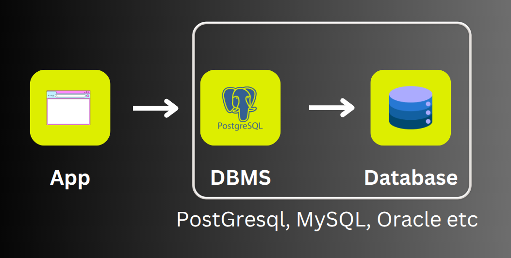
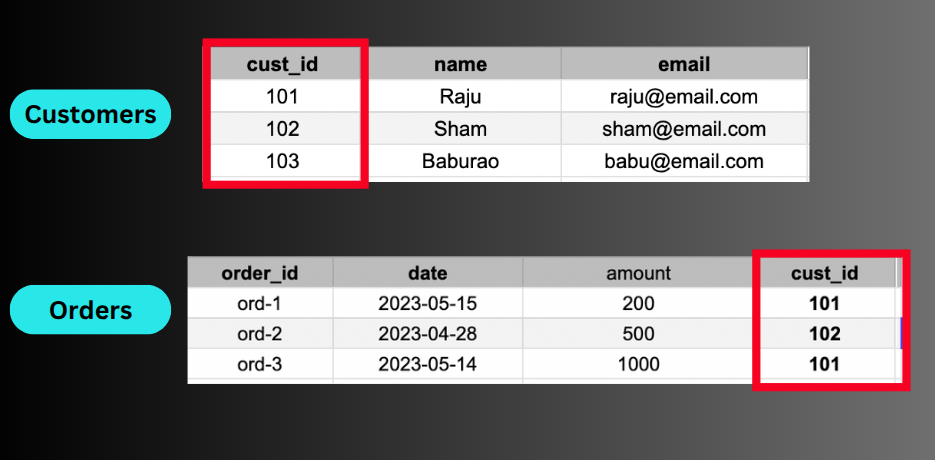

# PostgreSQL Notes

#### What is a database ?

**Answer**: An organised collection of data . A method to manipulate and access the data 

#### Database vs DBMS ?

**Answer**:



#### What is RDBMS ?

**Answer**:

A type of database system that stores data in structured tables(using rows and columns ) and uses SQL for managing and querying data

#### What is SQL ?

**Answer**:

Structured Query Language which is used to talk to our databases

Example : SELECT * FROM person_db;

#### Basic Installation steps

**Answer**:

psql => Enter the postgresql shell

\conninfo => connection info

\q => quits the shell

\l => lists all the databases

CREATE DATABASE TEST; => creates a database called TEST

ctrl + L => clears screen 

#### Dropping a database

**Answer**:

To drop a database use the following command : 

`drop database h` 
If we get the following error 

`ERROR: database "h" is being accessed by other users
There is 1 other session using the database. 
SQL state: 55006
Detail: There is 1 other session using the database.`

then terminate the sessions manually by 

`SELECT pg_terminate_backend(pg_stat_activity.pid)
FROM pg_stat_activity
WHERE pg_stat_activity.datname = 'h'
  AND pid <> pg_backend_pid();`

If we get this error : 

`ERROR: cannot drop the currently open database 
SQL state: 55006`

Then switch to another database and then drop the database 

#### CRUD Operations

Table : A table is a collection of related data held in a table format within a database 

First create a  database called *person_db*

**Creating a new Table***

```sql
CREATE TABLE person(

id INT,

name VARCHAR(100),

city VARCHAR(100)
);
```

**Inserting Data**

To insert data into a table use the following command 

```sql
INSERT INTO person (id,name,city)
values (101,'Suvadeep','Indore')
```

Note => We must pass 'Suvadeep' with single quotes because double quotes " are for column or table names in PostgreSQL

To insert multiple values 

```sql
insert into person (id,name,city)
values (102,'Sham','Mumbai'),
(103,'Paul','Chennai'),
(104,'Alex','Pune');
```

#### Reading data from a Table

To read data from a table run the following commands

```sql
select * from <table_name>;

select <column_name> from <table_name>;
```

Example 

```sql
select * from person;

select name from person;
```

#### Updating data

To update data run the following command 

```sql
update person set city ="london" where id =101
```

#### Delete data from a table

To delete data run the following command 

```sql
delete from person where id =102
```

#### Data Types

Data types => An attribute that specifies the type of data in a column of our database_table 

Most commonly used are 

Numerc - INT DOUBLE FLOAT DECIMAL 

String - VARCHAR

Date - DATE

Boolean - BOOLEAN

#### Constraint

A constraint in PostgreSQL Is a rule applied to a column

#### Primary Key

- The PRIMARY KEY constraint uniquely identifies each record in a table

- Primary keys must contain UNIQUE values , and cannot contain NULL values 

- A table can have only ONE primary key

#### Not Null

```sql
create table customers 

(

id int not null , 

name varchar(100) not null

)
```

#### Default Value

```sql
create table customers(

acc_no int primary key,

name varchar(100) not null,

acc_type varchar(50) not null default 'Savings'

)
```

#### Auto Increment

```sql
create table employees(

id serial primary key,

firstname varchar(50),

lastname varchar(50)

)
```

#### Clauses

Where Clause Examples;-

```sql
select * frpm employees where emp_id = 5
```

```sql
select * from employees where dept='HR';
```

```sql
select * from employees where dept='HR';
```

```sql
select * from employees where dept ='IT' or dept='Finance';
```

```sql
select * from employees where dept ='IT' and salary>50000;
```

 IN Operator => select all in 

NOT IN Operator => selects all not in 

```sql
select * from employees where dept in ('IT','Finance','HR');
```

```sql
select * from employees where dept not in ('IT','Finance','HR');
```

**Find employees whose salary is more than 40000 and less than 65000** ? 

```sql
select * from employees where salary between 40000 and 65000
```

Distinct =>Chooses only distinct 

```sql
select distinct dept from employees;
```

Order by => sorts data according to column by default in ascending order 

```sql
select * from employees order by fname;
```

```sql
select * from employees order by fname desc;
```

The above querry will sort by descending order of fname 

```sql
select * from employees order by emp_id desc;
```

THe above querry will sort in descending order by emp_id

```sql
select * from employees limit 3 
```

The above querry will only show the first 3 details of employees 

```sql
select * from employees where fname like 'A%';
```

THe above querry will select details of employees whose first name starts with A 

```sql
select * from employees where fname like '%A'
```

The above querry will select detaisl of employees whose last name ends with A 

```sql
select * from employees where fname like '%i%';
```

The above querry will select details of employees who have i in their fname

```sql
select * from employees where dept like '__';
```

The above querry will select details of employees where department is of 2 charcters

```sql
select * from employees where dept like '_A%';
```

The above querry will select details of employees where second charcte of department is A

---

## Section 5 (Aggregate Functions)

Use cases of aggregate functions : 

- How to find total number of employees ? 

- Employee with max salary 

- Average salary of emplyees 

Common aggregate functions 

- Count

- Sum

- Avg

- Min

- Max

**Count number of rows**:*

```sql
select count(emp_id) from employees;

select count(fname) from employees; 
```

**Count salary of all employees**:

```sql
select sum(salary) from employees;
```

**Count average salary of all employees**:

```sql
select avg(salary) from employees;
```

**Count minimum salary**:

```sql
select min(salary) from employees;
```

**Count maximum salary**:

```sql
select max(salary) from employees;
```

Group by examples:

1. select dept from employees group by dept; 

2. select dept,count(fname) from employees group by dept;

3. select dept,sum(salary) from employees group by dept;

---

#### Section -6 (String Functions)

concat syntax => *concat(first_col,sec_col)*

Examples 

- select concat(fname,lname) from employees;

- select concat(fname,lname) as fullname from employees;

- select emp_id,concat(fname, ' ',lname) as fullname,dept from employees;

concat_ws syntax => concat_ws('-',fname,lname)

Examples 

- select concat_ws('-',fname,lname) as fullname from employees;

- select concat_ws('-','One','Two','Three');

substring 

examples 

- select substring('Hello Buddy!',1,5);

REPLACE syntax => REPLACE(str,from_str,to_str)

Examples 

- REPLACE('Hey Buddy','Hey','Hello) will be Hello Buddy

- select replace('ABCXYZ','ABC','PQR'); will PQRXYZ

- select replace(dept,'IT','Tech') from employees;

REVERSE

examples 

- SELECT REVERSE('Hello');

- select reverse(fname) from employees;

LENGTH

examples

- select length('Hello World'); => 11

UPPER

examples

- select upper(fname) from employees;

LEFT,RIGHT,TRIM 

examples 

- select left('Abcdefghij',3);

- select right('Abcdefghij',4);

- select trim('    Alright!   ');

POSITION

examples

- SELECT POSITION('om' in 'Thomas');

---

#### Alter Tables

```sql
create table person(

id INT,

name varchar(100),

city varchar(100)

);

insert into person(id,name,city)
values (102,'Sham','Mumbai'),
(103,'Paul','Chennai'),
(104,'Alex','Pune');
```

**How to add or remove a column ?****

Adding Column : 

```sql
Syntax ;- alter table contacts add column city varchar(50)
```

Example :

```sql
 alter table person add column age INT
```

Dropping Column : 

Syntax : 

```sql
alter table contacts drop column city
```

Example : 

```sql
alter table person drop column age 
```

Adding a column with a default value of 0

```sql
alter table person add column age int default 0 
```

Renaming a column : 

Syntax : 

```sql
alter table contacts rename column name to full_name 
```

example: 

```sql
alter table person rename column name to fname;
```

**How to rename a table name ?**

There are 2 ways to rename a table name ? 

1. alter table contacts rename to mycontacts;

2. rename table contacts to mycontacts;

**How to modify a column ? (Changing datatype or adding default value) ?**

```sql
alter table person alter column fname set data type varchar(200)
```

```sql
alter table person alter column fname set deafult 'unknown';
```

**How to set NOT NULL ?**

```sql
alter table person alter column fname set not null
```

**Check Contstraint*:

To create a table with check constraint use the following querry :

```sql
create table contacts (

name varchar(50),

mob varchar(150) unique check (length(mob)>=10)

)
```

Example : -

```sql
alter table person

add column varchar(15) check (length(mob)>=10);


insert into person (mob) values (123) (Will throw an error)


insert into person (mob) values (1234567890) (Will work)
```

Alter table drop and add constraint:

```sql
alter table contacts drop constraint mob_no_less_than_10digits
```

```sql
alter table contacts add constraint mob_not_null check (mob!=null)
```

Examples :

```sql
alter table person drop constraint person_mob_check ;

insert into person (mob) values(123);
```

**Named Constraint***

```sql
create table contacts(

name varchar(50),

mob varchar(15),
constraint mob_no_less_than_10_digits check(length(mob)>=10)

)

insert into contacts (mob) values ('123') (will result in an error)


insert into contacts (mob) values ('1234567890');
```

**Case***
Case Syntax: 

```sql
select fname,salary 

case 

when salary > = 50000 then 'high'

else 'Low'

end as sal_cat from employees;
```

Example : 

```sql
select fname,salary

case 

when salary >55000 then 'high'

when salary between 48000 and 55000 then 'mid'

else 'Low'

end as sal_cat

from employees;
```

---

#### Relationship

Types of relationship : 

- One to One

- One to Many

- Many to Many 

Create a database => create db => storedb

The One-Many relationship we will be using : 



Create a customers and an orders table 

```sql
create table customers(

cust_id serial primary key,

cust_name varchar(100) not null

)

create table orders(

ord_id serial primary key,

ord_date date not null,

price numeric not null,

cust_id integer not null,

foreign key(cust_id) references customers(cust_id)

)
```

Insert the following data into the customers table 

```sql
insert into customers(cust_name) values ('Raju'),('Sham'),('Paul'),('Alex');
```

Insert the following data into the orders table 

```sql
insert into orders (ord_date,cust_id,price)

values

('2024-01-01',1,250.00),

('2024-01-15',1,300.00),

('2024-02-01',2,150.00),

('2024-03-01',3,450.00),

('2024-04-04',2,550.00);
```

Join operation is used to combine rows from two or more tables based on a related column between them 

Types of join : 

- cross join 

- inner join 

- left join

- right join 

**CROSS JOIN*** : Every table from one table is combined with every row from another table 

Example : `select * from cutsomers cross join orders;`

**INNER JOIN**: Returns only the rows where there is a match between the specified columns in both the left(or first) and right(or second) tables 

```sql
select * from customers c inner join orders o on c.cust_id=o.cust_id;
```

**INNER JOIN WITH GROUP BY**:

```sql
select name from customers

inner join orders 

on orders.cust_id = customers.cust_id

group by name; 

```

Example : 

```sql
select c.cust_name , count(o.ord_id) from 

customers c 

inner join 

orders o 

on c.cust_id= o.cust_id

group by cust_name;

```

Left Join : 

Returns all rows from the left(or first) table and the matching rows from the right (or second ) table 

```sql
select * from customers c 

left join 

orders o 

on c.cust_id = o.cust_id;

```

---

#### Many - Many Relationship

Create a students table : 

```sql
create table students(

s_id serial primary key,

name varchar(100) not null

)


```

  Create a courses table : 

```sql
create table courses(

c_id serial primary key,

name varchar(100) not null,

fee numeric not null

)

```

Create the join table(Enrollment)

```sql
create table enrollment(

emrollment_id serial primary key,

s_id int not null,

c_id int not null,

enrollment_date date not null,

foreign key(s_id) references students(s_id),

foreign key(c_id) references cources(c_id)

)

```
